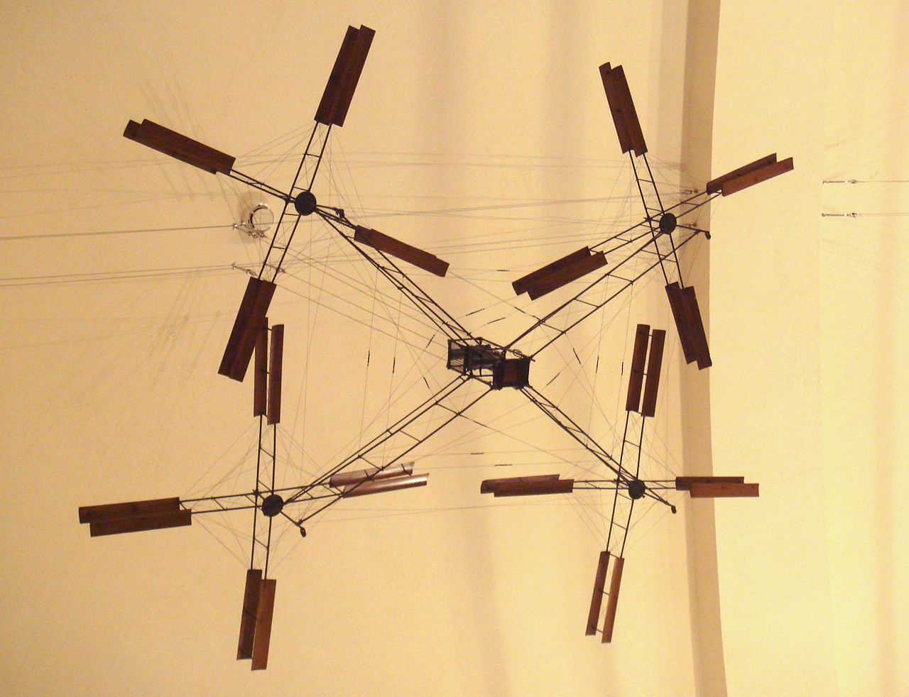
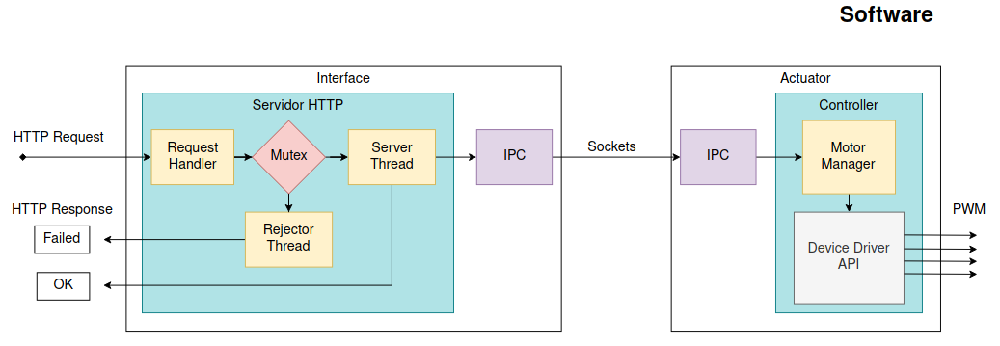

# Breguet
## Projeto
  Como projeto da disciplina foi escolhido o tema de drones. Nesse projeto serão controlados
  quatro motores /brushlesss/ (BLDC), como na configuração de um drone quadrotor.

## Objetivos
  do final do projeto, acima da aplicação, é aplicar os conhecimentos sobre sistemas embarcados
  adquiridos ao longo do semestre. Isso inclui, Linux Embarcado, Comunicação em Rede, Comunicação
  entre Processos e Protocolos de Comunicação.

## Codenome
   O codenome do projeto é referencia a Louis Charles Breguet, um dos primeiros a tentar construir
   maquinas de voo com rotores.

  

## Arquitetura
  O projeto foi divido em duas aplicações independentes:
   - Interface HTTP de Comandos
   - Controlador de Motores
   - Painel de Controle Web

  Seguindo recomendações, todo projeto será programado na linguagem C e será executado
  em no /System on a Chip/ (SoC) da Toradex. 

### Hardware

### Software

## Resultados
O projeto já foi em grande parte implementado. Os teste de integração 
e validação não foram conduzidos com o hardware da Toradex, mas com uma
Raspberry Pi 3. Ao invés de um motor BLDC, foi utilizado um servo. O que 
não altera tanto o projeto pois ambos são sinais de PWM. 

Como o principal objetivo era avaliar o aprendizado durante as aulas, pode-se
considerar o projeto como um sucesso. A arquitetura não sofreu alterações
para os testes, então foram implementados conceitos de multithreading, sockets,
IPC e Device Drivers com sucesso.

O ponto que deixa a desejar é em questão de mecanismos de sincronização
de threads. Foi proposto um mecanismo para que o servidor HTTP de comandos
não envie comandos de mais de um cliente simultâneamente. A mutex utilizada
funciona, mas o mecanismo de interação com o usuário não está totalmente 
funcional. 

### Demonstração
  

